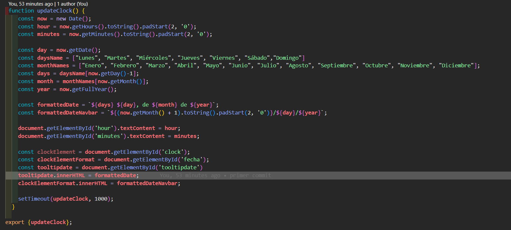
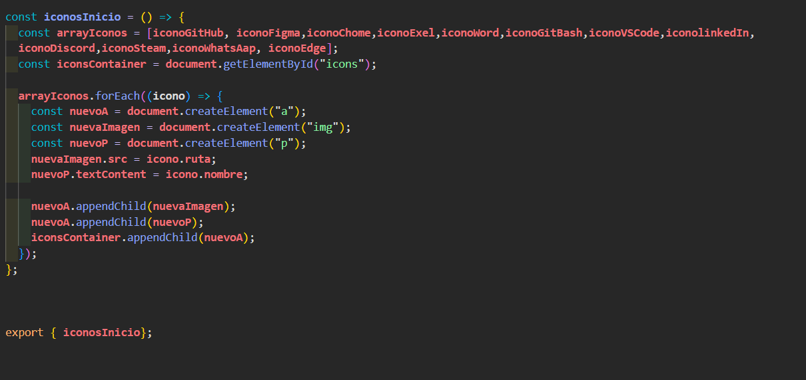

# Windows 11 Clone
El enlace a la pagina esta en la parte de About

## Tecnologías Utilizadas

 &nbsp;&nbsp;    &nbsp;&nbsp;   &nbsp;&nbsp; &nbsp;

## Para la escucha de Sass 
`sass:all: npm run sass:all`

# Para el tutor

## Objeto Date()

  

Utilización del objeto Date con sus métodos para obtener el dia hora y año.

## Método forEach()

  

Utilizacion del método foreach para recorrer cada elemento del array compueto por objetos.

### Conclución

De esta forma estaria cumpliendose lo pedido para la segunda pre-entrega.